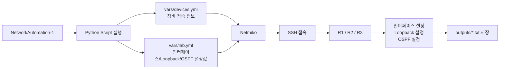
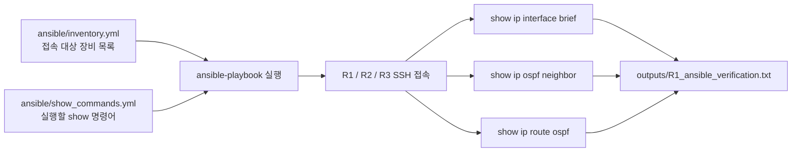

# GNS3 Network Automation Lab


## 📌 프로젝트 개요

GNS3 환경에서 Cisco IOS 라우터 3대와 Linux 기반 자동화 노드를 구성하고, Python, YAML, Netmiko, Ansible을 활용하여 네트워크 장비 설정 및 검증 작업을 자동화한 실습 프로젝트입니다.

본 프로젝트에서는 라우터의 SSH 접속 환경을 수동으로 초기 구성한 뒤, Python Netmiko 스크립트를 통해 라우터 간 인터페이스 IP, Loopback, OSPF 설정을 자동으로 적용했습니다. 이후 Ansible Playbook을 사용하여 여러 라우터의 인터페이스 상태, OSPF Neighbor, 라우팅 정보를 일괄 검증했습니다.

---

## 🧩 Lab Topology

```mermaid
flowchart TB
    NA[NetworkAutomation-1<br/>192.168.100.10/24] --- SW1[SW1<br/>L2 Management Switch]

    SW1 --- R1[R1<br/>e0/0: 192.168.100.11]
    SW1 --- R2[R2<br/>e0/0: 192.168.100.12]
    SW1 --- R3[R3<br/>e0/0: 192.168.100.13]

    R1 ---|10.0.12.0/30| R2
    R2 ---|10.0.23.0/30| R3
    R1 ---|10.0.13.0/30| R3

    R1 -. Loopback0: 1.1.1.1/32 .- R1
    R2 -. Loopback0: 2.2.2.2/32 .- R2
    R3 -. Loopback0: 3.3.3.3/32 .- R3
```

### 관리망 구성

| 장비 | 인터페이스 | 역할 | IP 주소 |
| --- | --- | --- | --- |
| NetworkAutomation-1 | eth0 | 자동화 실행 노드 | 192.168.100.10/24 |
| R1 | e0/0 | 관리망 인터페이스 | 192.168.100.11/24 |
| R2 | e0/0 | 관리망 인터페이스 | 192.168.100.12/24 |
| R3 | e0/0 | 관리망 인터페이스 | 192.168.100.13/24 |
| SW1 | e0/0~e0/3 | 관리망 L2 스위치 | - |

---

## 🛠 사용 기술 및 역할

| 기술 | 사용 목적 |
| --- | --- |
| **Python** | 자동화 실행 로직 작성 |
| **YAML** | 장비 접속 정보와 설정값 분리 관리 |
| **Netmiko** | Python에서 Cisco IOS 장비로 SSH 접속 및 CLI 명령 실행 |
| **Ansible** | 여러 라우터에 show 명령어 일괄 실행 및 상태 검증 |
| **Cisco IOS** | 라우터 설정 및 OSPF 라우팅 구성 |
| **GNS3** | 네트워크 토폴로지 구성 및 실습 환경 제공 |

---

## 🔁 자동화 흐름



---

## 🐍 Python Netmiko 자동화

Python Netmiko는 설정 자동화에 사용했습니다.

| 스크립트 | 역할 |
| --- | --- |
| `01_show_interfaces.py` | R1/R2/R3에 SSH 접속 후 `show ip interface brief` 결과 수집 |
| `02_config_interfaces_loopback.py` | 라우터 간 링크 IP와 Loopback 인터페이스 자동 설정 |
| `03_config_ospf.py` | OSPF Area 0 자동 설정 및 Neighbor/Route 검증 |

### Python Netmiko 동작 구조

```text
vars/devices.yml
= 어디에 접속할지 정의
= R1/R2/R3 IP, username, password, device_type

vars/lab.yml
= 무엇을 설정할지 정의
= 인터페이스 IP, Loopback IP, OSPF Router-ID

Python Script
= YAML 파일을 읽고 Cisco IOS 명령어 생성

Netmiko
= SSH로 라우터 접속 후 CLI 명령어 실행

outputs/
= 실행 결과 저장
```

---

## ⚙️ Ansible 기반 검증

Ansible은 Python Netmiko로 적용한 설정이 정상적으로 반영되었는지 검증하는 용도로 사용했습니다.



### Ansible 구성 파일

| 파일 | 역할 |
| --- | --- |
| `ansible/inventory.yml` | Ansible이 접속할 R1/R2/R3 장비 목록 |
| `ansible/show_commands.yml` | 각 라우터에서 실행할 show 명령어 정의 |
| `outputs/*_ansible_verification.txt` | Ansible 실행 결과 저장 파일 |

---

## 📁 프로젝트 구조

```text
gns3-network-automation-lab/
├── README.md
├── requirements.txt
├── ansible/
│   ├── inventory.example.yml
│   └── show_commands.yml
├── docs/
├── outputs/
│   ├── show_interfaces_before.txt
│   ├── show_interfaces_after.txt
│   ├── ospf_verification.txt
│   ├── R1_ansible_verification.txt
│   ├── R2_ansible_verification.txt
│   └── R3_ansible_verification.txt
├── python/
│   ├── 01_show_interfaces.py
│   ├── 02_config_interfaces_loopback.py
│   └── 03_config_ospf.py
├── screenshots/
└── vars/
    ├── devices.example.yml
    └── lab.yml
```

---

## 🚀 실행 방법

### 1. NetworkAutomation-1 IP 설정

```bash
ifconfig eth0 192.168.100.10 netmask 255.255.255.0 up
ifconfig eth0
```

### 2. Python 패키지 설치

```bash
pip3 install -r requirements.txt
```

### 3. 장비 접속 정보 파일 생성

`vars/devices.example.yml` 파일을 참고하여 실제 실행용 파일을 생성합니다.

```bash
cp vars/devices.example.yml vars/devices.yml
```

실제 실행용 `vars/devices.yml`에는 라우터 접속 비밀번호를 입력합니다.

### 4. 인터페이스 상태 수집

```bash
python3 python/01_show_interfaces.py
```

결과 확인:

```bash
cat outputs/show_interfaces_before.txt
```

### 5. 인터페이스 및 Loopback 자동 설정

```bash
python3 python/02_config_interfaces_loopback.py
```

결과 확인:

```bash
cat outputs/show_interfaces_after.txt
```

### 6. OSPF 자동 설정 및 검증

```bash
python3 python/03_config_ospf.py
```

결과 확인:

```bash
cat outputs/ospf_verification.txt
```

### 7. Ansible 검증 실행

```bash
ANSIBLE_HOST_KEY_CHECKING=False ansible-playbook -i ansible/inventory.yml ansible/show_commands.yml
```

결과 확인:

```bash
cat outputs/R1_ansible_verification.txt
cat outputs/R2_ansible_verification.txt
cat outputs/R3_ansible_verification.txt
```

---

## ✅ 결과 파일

| 결과 파일 | 생성 도구 | 내용 |
| --- | --- | --- |
| `show_interfaces_before.txt` | Python Netmiko | 인터페이스 상태 수집 및 SSH 접속 검증 결과 |
| `show_interfaces_after.txt` | Python Netmiko | 인터페이스 및 Loopback 설정 후 상태 |
| `ospf_verification.txt` | Python Netmiko | OSPF 설정 및 검증 결과 |
| `R1_ansible_verification.txt` | Ansible | R1 상태 검증 결과 |
| `R2_ansible_verification.txt` | Ansible | R2 상태 검증 결과 |
| `R3_ansible_verification.txt` | Ansible | R3 상태 검증 결과 |

---

## 🔐 보안 처리

실제 접속 정보가 포함된 파일은 GitHub에 업로드하지 않습니다.

`.gitignore`에 다음 파일을 등록했습니다.

```gitignore
vars/devices.yml
ansible/inventory.yml
.env
```

공개 저장소에는 예시 파일만 업로드합니다.

| 실제 실행용 파일 | 공개용 예시 파일 |
| --- | --- |
| `vars/devices.yml` | `vars/devices.example.yml` |
| `ansible/inventory.yml` | `ansible/inventory.example.yml` |

---

## 🧪 Troubleshooting

| 문제 | 원인 | 해결 |
| --- | --- | --- |
| `Network is unreachable` | NetworkAutomation-1의 eth0 IP 미설정 | `ifconfig eth0 192.168.100.10 netmask 255.255.255.0 up` |
| `git: command not found` | GNS3 Linux 노드에 Git 미설치 | 필요한 파일을 직접 생성하여 실습 진행 |
| YAML 문법 오류 | 들여쓰기 또는 콜론 오류 | `cat -n vars/devices.yml`로 확인 후 YAML 재작성 |
| Ansible Host Key 오류 | 최초 SSH 접속 시 Host Key 확인 문제 | `ANSIBLE_HOST_KEY_CHECKING=False` 옵션 사용 |
| `Permission denied` | txt 파일을 실행하려고 입력함 | `cat outputs/파일명.txt`로 내용 확인 |

---

## 📚 학습한 내용

- Python Netmiko를 활용한 Cisco IOS 장비 SSH 접속
- YAML을 활용한 장비 접속 정보와 설정값 분리
- 라우터 간 인터페이스 IP 및 Loopback 설정 자동화
- OSPF Area 0 설정 및 Neighbor/Route 검증
- Ansible Inventory와 Playbook을 활용한 다중 장비 상태 검증
- GitHub를 활용한 네트워크 자동화 프로젝트 관리

---

## 📎 References

- GitHub Repository: https://github.com/deokduckhan/gns3-network-automation-lab
- Lab Report: Notion 링크 추가 예정
